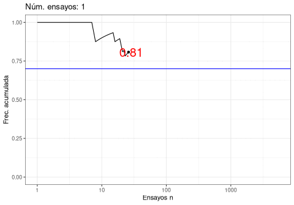

```{r setup, include=FALSE}
library(knitr)
library(xaringan)
options(htmltools.dir.version = FALSE)
url_logo <- "https://upload.wikimedia.org/wikipedia/de/e/e0/Logo_ITESO_Universidad_Guadalajara.svg"

if (!dir.exists("img/")) {
  dir.create("img/")
}
download.file(
  url_logo,
  destfile = "img/logo_ITESO.svg",
  mode = "wb"
)
opts_chunk$set(
  echo = FALSE, warning = FALSE, message = FALSE, comment = "#>",
  fig.path = "figure/", fig.align = "center", fig.height = 8.5,
  out.width = "100%", fig.show = "hold", fig.retina = 3,
  cache = TRUE, cache.path = "cache/"
)
```

```{r xaringan-themer, include=FALSE, warning=FALSE}
library(xaringanthemer)
style_duo(
  primary_color = "#bb5e5e", # "#06436E",
  secondary_color = "#1f4b64", # "#F97B64",
  text_font_family = "Latin Modern Sans",
  text_font_size = "1.2rem",
  # header_font_family = "Latin Modern Sans",
  # code_font_family = "FiraCode Nerd Font"
  header_font_google = google_font("Martel"),
  text_font_google = google_font("Lato"),
  code_font_google = google_font("Fira Mono"),
  colors = c(
    red = "#f34213",
    purple = "#3e2f5b",
    orange = "#c46303f8",
    green = "#136f63",
    white = "#FFFFFF",
    gray = "#c9c9c9",
    bermellon = "#F97B64",
    black = "#020202",
    charcoal = "#8393A8",
    brownish = "#A89883"
  )
)
```

class: center, title-slide, inverse-slide

<style>
.title-slide .remark-slide-number {
  display: none;
}

.title-slide h1 {
font-weight: bold;
font-size: 50px;
color: #5F7C8C;
}

.title-slide h2 {
font-weight: bold;
font-size: 40px;
color: #5F7C8C;
}

.subtitle-slide h1 {
  font-weight: bold;
  font-size: 40px;
}

.inverse-slide {
  background-color: #EFF8F4;
  color: #B80D48;
}


.black-slide {
  background-color: #020202;
  color: #B80D48;
}

</style>

<style>
.remark-slide-content {
  font-size: 28px;
  color: #1f4b64;
}
}

</style>

<style>

.center2 {
  margin: -1%;
  position: absolute;
  top: 65%;
  left: 51%;
  width: 180px;
  height: 128px;
  -ms-transform: translate(-50%, -50%);
  transform: translate(-50%, -50%);
}

.logo {
  position: absolute;
  top: 1em;
  right: 1em;
  width: 110px;
  height: 128px;
  z-index: 0;
}

.my-one-page-font {
  font-size: 20px;
}

</style>

<style>
blockquote {
    background-color: #3A0E38;
}
</style>

# Estadística a través de las simulaciones
# Emmanuel Alcalá
## Departamento de Matemáticas y Física

.center2[
```{r echo = FALSE}

```
]

---
class: middle

## Problema

.pull-left[
```{r hello}
cowsay::say(
  "La estadística es muy importante para todos",
  by = "cow"
)
```
]

.pull-right[
<br>
<br>
<br>

como para enseñarla solo a los ~~matemáticos~~

.typed[]

]

---
class: middle

## Problema

.pull-left[

- La ubicuidad de los **datos** en todos los ámbitos y profesiones.
  
- La dependencia de la estadística en las matemáticas.
  
- Las carencias en matemáticas en profesiones CTIM<sup>1</sup>.

- La necesidad de ciudadanos alfabetizados en datos (*data literacy*).

]

.pull-right[

```{r echo = FALSE}

```

]

$$\\[0.5in]$$

.footnote[
  [1] **C**iencia, **T**ecnología, **I**ngeniería y **M**atemáticas.
]

---
class: subtitle-slide, middle, inverse-slide
# ¿Cómo enseñar estadística en carreras no CTIM?


--

  # Una propuesta:

  # .charcoal[Estadística basada en simulaciones]

---
class:middle

.content-box-blue[
  **Simulación** 
  
  Imitación basada en modelos de un proceso para estudiar su comportamiento. En .orange[estadística], una simulación es la imitación de un proceso aleatorio.
]
--
  
La simulación a volver claros y concretos conceptos, ya que permite ver interactuar con el proceso que se simula: cambiar condiciones y observar los resultados<sup>1</sup> .

.footnote[
  [1] Sigal et al (2016). Play it again: Teaching statistics with Monte Carlo simulation. *Journal of Statistics Education*.
]

---
class: subtitle-slide, middle, inverse-slide

## Ejemplo: distribución muestral de la media

---
.content-box-blue[
  **Distribución muestral** 
  
  La distribución de un estadístico, como la media, cuando se toman ensayos repetidos de tamaño $n$.
]

--

Típicamente en política los candidatos suelen mostrar como honesta aquella encuesta en que le fue mejor.

--

En ocasiones, instrumentalizan políticamente los resultados: las encuestas en las que les va peor están *cuchareadas* o amañadas. 

--
  
Muchas personas ven en esta variabilidad en los resultados como un indicio de corrupción.

--

Pero la explicación *puede* ser más sencilla: el proceso de medir la opinión es aleatorio, y diferentes encuestas miden diferentes muestras.

---
class: middle 

- El camino natural para enseñar el concepto de la distribución muestral de la media es usar algunos **teoremas**.

--

- Pero los **teoremas**, en calidad de abstracciones, son en extremo obscuros: es difícil derivar sus implicaciones sin un **.purple[bagaje]** formal difícil de adquirir.
--

  - E.g., teoría de conjuntos, cálculo uni- y multivariable, cálculo integral, combinatoria, análisis, etc.

---
class: inverse-slide, middle

# Aplicación: 

## Teorema del límite central
## Ley de los Grandes Números

---
.content-box-blue[
  **TLC** 
  
  Suponer que una variable aleatoria es de *cualquier* distribución. Si se toman $X_1, X_2, \dots, X_n$ muestras, la media muestral $\bar X_n$ tiene distribución normal conforme $n \rightarrow \infty$.

$$
  Z = \lim_{n \rightarrow \infty} \left( \frac{\bar X_n - \mu}{\sigma\sqrt{n}} \right)\; \text{ tiene distribución normal estándar}
$$

]
--

.content-box-blue[
  **LGN** 
  
  Suponer que se realiza un experimento aleatorio $n$ veces. El valor promedio del resultado se aproxima al valor esperado conforme $n \rightarrow \infty$

$$
  \bar{X}_n \rightarrow \mu\; \text{ cuando } n \rightarrow \infty
$$

]

---
class: middle

Ambos teoremas están basados *conceptualmente* en la idea de repetición de un evento muchas (o infinito número de veces).

--
  
Con un lenguaje de programación sencillo, como **`Python`** o **`R`**, ilustrar ambos teoremas, y por ende el concepto de distribución muestral de la media, es muy sencillo.


---
class: black-slide, middle, center

## .white[Teorema del límite central]
## .white[Simulación en `Python::manim`]

<video width="70%" height="70%" controls id="my_video">
  <source src="img/CentralLimitTheorem.mp4" type="video/mp4">
</video>


---
class: black-slide, middle, center

## .white[Ley de los Grandes Números]
## .white[Simulación en `R::gganimate`]

 

---
class: inverse-slide, middle

# Recursos
## .charcoal[Software libre ]
---

Lamentablemente, este enfoque tiene un requisito mínimo: aprender a programar. Por fortuna, existen comunidades de software libre que se han encargado de facilitarlo enormemente. .black[Para hacer estas simulaciones no se requiere mucho más que saber usar unas funciones y ciclos for].

--

- **`Python::manim`:** una amplia y creciente comunidad de `manim` ha documentado y creado muchísimos tutoriales para simular y animar diferentes conceptos matemáticos.
  - Link: [https://www.manim.community/](https://www.manim.community/).
  - Para cursos/tutoriales de **`Python`** se puede consultar: [https://docs.python.org/3/tutorial/](https://docs.python.org/3/tutorial/)

--
  
- **`R`** y **`R::gganimate`**: lo mismo ha sucedido con `R`. 
  - Link: [https://gganimate.com/articles/gganimate.html](https://gganimate.com/articles/gganimate.html).
  - Tutoriales para comenzar con **`R`**: [https://datacarpentry.org/R-genomics/index.html](https://datacarpentry.org/R-genomics/index.html).

---
class: inverse-slide, middle, center

Comentarios o ayuda:

`jaime.alcala@iteso.mx`
